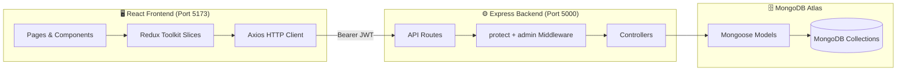
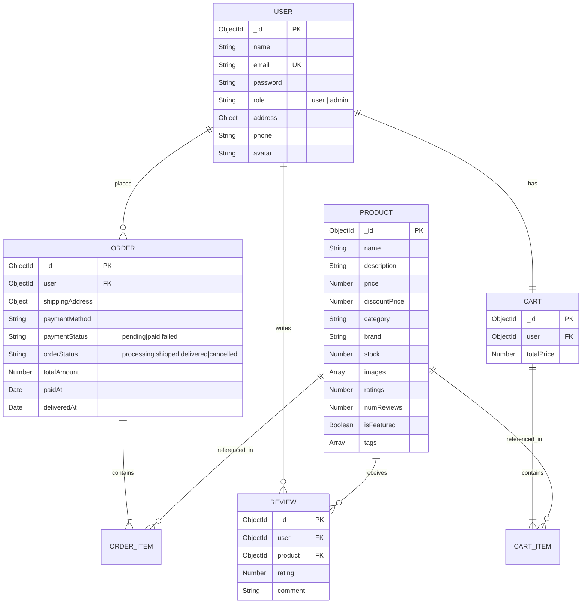

# 🏗️ Solution Architecture

**Project Name:** ShopEEZ — Full Stack MERN E-Commerce Platform
**Date:** June 2026

---

## 1. System Architecture

ShopEEZ uses a **decoupled client-server architecture** following the **MVC pattern**:



---

## 2. Folder Structure

```
SHOPEEZZ/
├── client/                          # React 19 + Vite Frontend
│   └── src/
│       ├── api/                     # Axios instance with JWT interceptor
│       ├── components/              # Navbar, Footer, ProductCard, ProtectedRoute
│       ├── pages/                   # Customer pages (Home, Cart, Checkout...)
│       │   └── admin/               # Admin pages (Dashboard, Products, Orders)
│       ├── redux/
│       │   ├── store.js             # Redux store configuration
│       │   └── slices/
│       │       ├── authSlice.js     # Login/register/logout state
│       │       ├── cartSlice.js     # Cart items + totals + localStorage sync
│       │       ├── productSlice.js  # Product catalog + search/filter state
│       │       └── wishlistSlice.js # Wishlist items state
│       ├── App.jsx                  # Route definitions (Public + Protected + Admin)
│       └── index.css                # Global dark theme CSS variables
│
└── server/                          # Node.js + Express Backend
    ├── config/
    │   └── db.js                    # MongoDB Atlas connection
    ├── controllers/
    │   ├── authController.js        # register, login, getMe, updateProfile
    │   ├── productController.js     # getProducts, getProductById, reviews
    │   ├── cartController.js        # getCart, addToCart, removeFromCart
    │   ├── orderController.js       # createOrder, getMyOrders
    │   └── adminController.js       # Dashboard stats, product/order/user CRUD
    ├── middleware/
    │   ├── authMiddleware.js        # JWT verify → req.user
    │   ├── adminMiddleware.js       # req.user.role === 'admin' check
    │   ├── uploadMiddleware.js      # Multer for image uploads
    │   └── errorHandler.js         # Global 404 + error handler
    ├── models/
    │   ├── User.js                  # name, email, password (bcrypt), role, address
    │   ├── Product.js               # name, price, discountPrice, category, stock
    │   ├── Cart.js                  # user ref, items[], totalPrice
    │   ├── Order.js                 # user ref, items[], shippingAddress, status enums
    │   └── Review.js                # user ref, product ref, rating, comment
    ├── routes/
    │   ├── authRoutes.js            # /api/auth/*
    │   ├── productRoutes.js         # /api/products/*
    │   ├── cartRoutes.js            # /api/cart/*
    │   ├── orderRoutes.js           # /api/orders/*
    │   └── adminRoutes.js           # /api/admin/* (double-protected)
    ├── seed.js                      # Database seeder (products + admin account)
    └── server.js                    # Express app entry point

```

---

## 3. Database Entity Relationship Diagram



---

## 4. Security Architecture

| Layer | Mechanism | Implementation |
|:--|:--|:--|
| Password Storage | Bcrypt (salt 10) | `pre('save')` hook in `User.js` |
| Authentication | JWT Bearer Token | `protect` middleware in `authMiddleware.js` |
| Authorization | Role-based (user/admin) | `admin` middleware in `adminMiddleware.js` |
| Admin Routes | Double middleware guard | `router.use(protect); router.use(admin)` in `adminRoutes.js` |
| CORS | Origin whitelist | Express CORS config in `server.js` |
