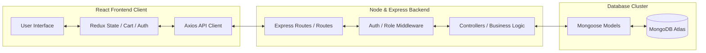

# Proposed Solution — ShopEEZ

## 1. Technological Architecture Choice: The MERN Stack
We have chosen the **MERN (MongoDB, Express.js, React.js, Node.js)** tech stack to build a decoupled client-server architecture:

- **MongoDB (Database)**: A document-oriented NoSQL database that holds product catalogs, users records, shopping carts, and order details as JSON-like documents, matching Mongoose model configurations.
- **Express.js (Server Framework)**: A minimalist backend web framework running on Node.js to route incoming HTTP REST requests, apply authentication middleware, and execute database queries.
- **React.js (Frontend library)**: Scaffolded via **Vite** for high-speed module replacements, rendering reactive UI views, managing client routing (React Router v6), and using Redux Toolkit for state synchronization.
- **Node.js (Runtime)**: Executes backend JavaScript processes, handles environment variables, and hosts API services.

---

## 2. Decoupled Architecture Design

ShopEEZ operates as a decoupled client-server model:

---

## 3. Implementation Highlights

- **JWT Session Persistence**: Standard state configurations use JSON Web Tokens returned on login. The client intercepts this token and appends it to request headers (`Authorization: Bearer <token>`) for safe resource access.
- **Redux Toolkit State Slices**:
  - `authSlice.js`: Tracks authenticated login states, users info, and permissions roles.
  - `cartSlice.js`: Manages items counts, computes totals, and writes to LocalStorage.
  - `productSlice.js`: Handles catalog loading states and search filter metrics.
  - `wishlistSlice.js`: Saves favorites locally.
- **Global Styles Theme**: Curated dark-themed palette utilizing variables defined inside `index.css` for consistent backgrounds, border highlights, and text elements.
