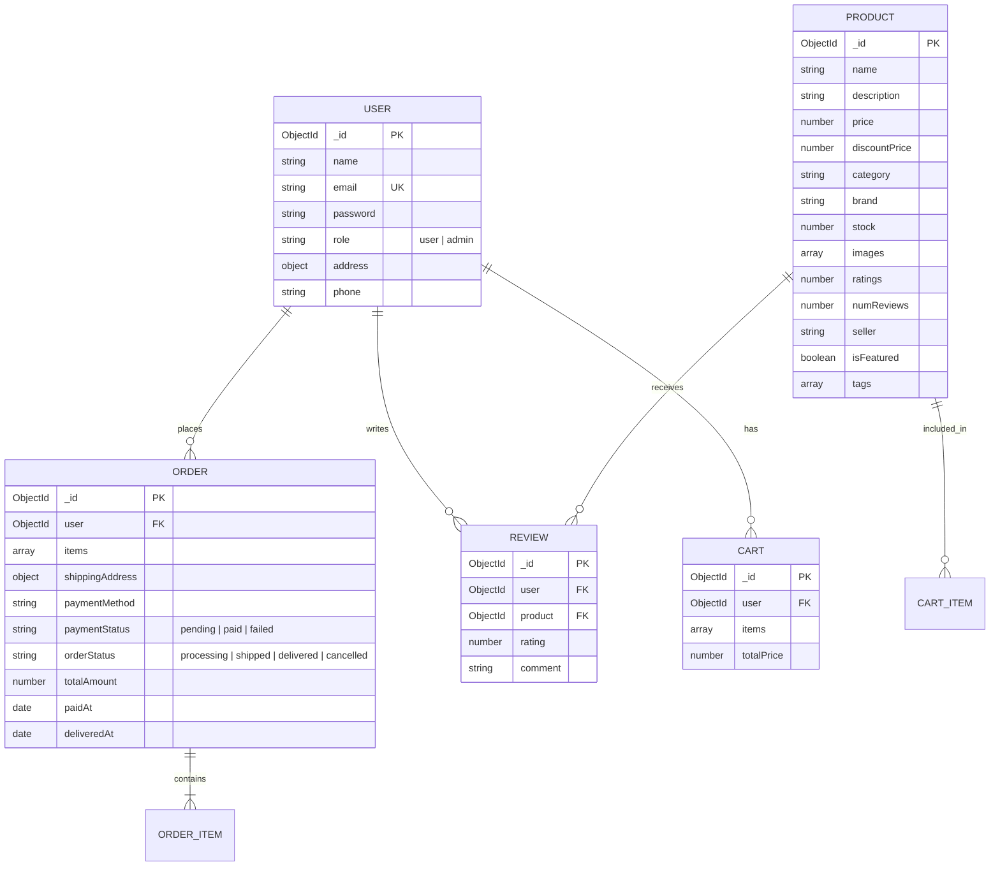

# Solution Architecture — ShopEEZ

This document provides a technical walkthrough of the architectural modules, data schemas, and folder structures implemented in **ShopEEZ**.

---

## 1. Directory Structure Mappings

ShopEEZ is divided into independent frontend and backend packages:

```
shopez/
├── client/                 # React Frontend Client (Vite)
│   ├── src/
│   │   ├── api/            # Axios API configuration & intercepts
│   │   ├── components/     # Reusable layout elements (Navbar, Footer, ProductCard)
│   │   ├── pages/          # Pages (Home, Detail, Cart, Profile, Login)
│   │   │   └── admin/      # Admin Panel pages (Dashboard, Manage Products & Orders)
│   │   ├── redux/          # Redux Toolkit store and slices (auth, cart, product)
│   │   ├── App.jsx         # App router layouts and path mapping
│   │   ├── index.css       # Core design design variables and dark-theme style resetting
│   │   └── main.jsx        # App entry setup
├── server/                 # Node.js Express Backend
│   ├── config/             # DB settings (db.js)
│   ├── controllers/        # Express route business logic controllers
│   ├── middleware/         # Security, user role validations, error catchers
│   ├── models/             # Mongoose schemas (User, Product, Order, Cart, Review)
│   ├── routes/             # Express API endpoints
│   ├── server.js           # Server initializer
│   └── seed.js             # Seeding mock database collections
```

---

## 2. Entity Relationship Design

The database stores data using five Mongoose collections:



---

## 3. MVC Pattern Mapping in ShopEEZ

- **Model**: Mongoose schemas inside `server/models/` enforce types, validations, and hooks (e.g. hashing passwords before saving) directly on MongoDB.
- **View**: Handled completely on the client-side via React components (`client/src/pages/` and `client/src/components/`), using Redux hooks to subscribe to state changes and re-render.
- **Controller**: Backend controllers inside `server/controllers/` extract route parameters, execute query logic, and send clean JSON payloads back to the client.
