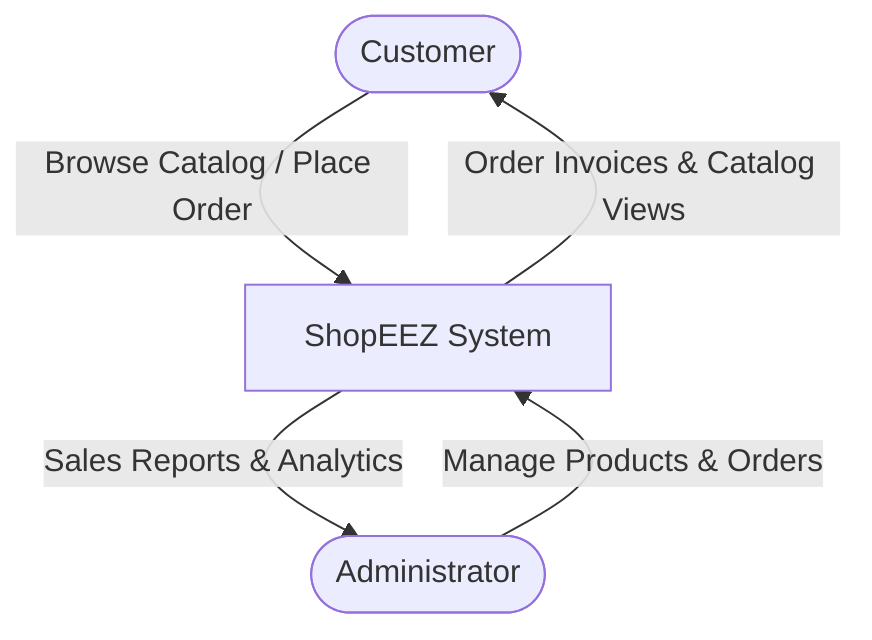
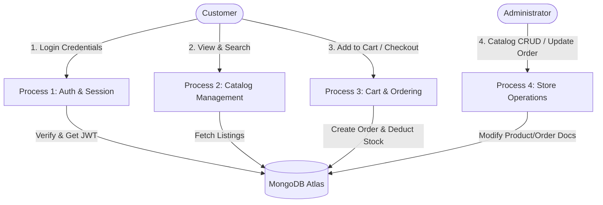

# Data Flow Diagrams & User Stories — ShopEEZ

This document specifies the target user interactions and how data cascades through the **ShopEEZ** system.

---

## 👥 User Stories

### 👤 Guest User
- **Story**: As a guest, I want to search and filter products by category or price so that I can find what I need before creating an account.
- **Story**: As a guest, I want to add items to my shopping cart so that I don't lose my selection while browsing.

### 💳 Customer
- **Story**: As a registered customer, I want to log in securely using my email and password so that I can access my profile and order history.
- **Story**: As a customer, I want to submit my shipping details and checkout my cart items so that I can place orders.
- **Story**: As a customer, I want to view my past orders and update my contact details inside my profile.

### 🛠️ Store Administrator
- **Story**: As an admin, I want to view a dashboard with total sales, user signups, and orders count so that I can monitor business performance.
- **Story**: As an admin, I want to add, edit, or delete products in real-time so that the store catalog is always up-to-date.
- **Story**: As an admin, I want to change order states (`processing` → `shipped` → `delivered`) so that customers can track their shipment progress.

---

## 📊 Data Flow Diagrams (DFD)

### Level 0: Context Diagram

### Level 1: System Process Flow

