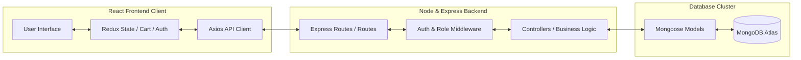
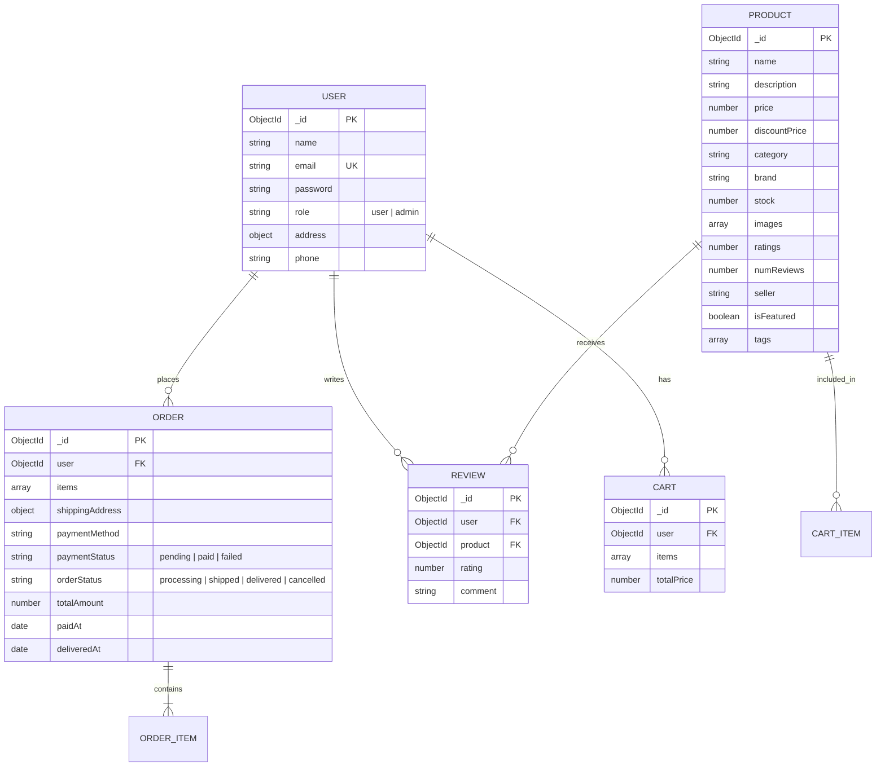

# 📂 ShopEEZ — MERN Phase-Wise Project Documentation

Welcome to the **ShopEEZ** MERN Phase-Wise Project Documentation. This document provides a complete compiled walkthrough of the requirements, architecture, designs, sprint plans, and functional specifications of the ShopEEZ E-Commerce platform.

---

## 🧭 Directory Index

*   **[Phase 1: Brainstorming & Ideation](#-phase-1-brainstorming--ideation)**
*   **[Phase 2: Requirement Analysis](#-phase-2-requirement-analysis)**
*   **[Phase 3: Project Design](#-phase-3-project-design)**
*   **[Phase 4: Project Planning](#-phase-4-project-planning)**
*   **[Phase 5: Project Development & UAT](#-phase-5-project-development--uat)**
*   **[FSD Documentation: Comprehensive Manual](#-fsd-documentation-comprehensive-manual)**

---

## 💡 Phase 1: Brainstorming & Ideation

### 1.1 Conception & Brainstorming Focus
ShopEEZ is conceived as a premium, lightweight full-stack e-commerce experience. Key ideation focus areas include:
*   **Visual Aesthetics**: A responsive, dark-themed storefront using vanilla CSS variables for fluid layout control.
*   **Persistent Shopping Session**: Integrating Redux state slices with LocalStorage and MongoDB synchronization to prevent cart contents loss.
*   **Authentication & Security**: Securing customer details using JWT sessions combined with salted Bcrypt password hashing.

### 1.2 MoSCoW Prioritization Matrix
*   **Must Have**: User Registration & Login (JWT), Product Catalog, Product Detail views, Shopping Cart (persist in LocalStorage), Address/Checkout processing, and Admin Product CRUD.
*   **Should Have**: Persistent Wishlist, Admin Dashboard Analytics, and Catalog Search/Category filters.
*   **Could Have**: Customer Review submissions and Cloudinary integration for catalog media storage.
*   **Won't Have**: Live credit card payment processing (mock payments are used instead) and carrier SMS updates.

### 1.3 Empathy Map Canvas
*   **Customer Persona (Rahul)**:
    *   *Think/Feel*: Worried about checkout security, excited about fast page rendering and premium dark aesthetics.
    *   *See*: Clean product catalogs with prices, brand tags, and rating reviews.
    *   *Do/Say*: Filters products by category/price, adds favorites to wishlist, inputs shipping coordinates.
    *   *Pains/Gains*: Frustrated by session reloads wiping out carts. Pleased with persistent, synchronized baskets.
*   **Admin Persona (Sarah)**:
    *   *Think/Feel*: Wants simple catalog updates, feels anxious when orders stack up unfulfilled.
    *   *See*: Dashboard statistics showing sales metrics, user growth, and low-stock indicators.
    *   *Do/Say*: Seed products, edit prices, update fulfillment states (`processing` → `shipped` → `delivered`).
    *   *Pains/Gains*: Needs instant CRUD options without manual DB script edits.

---

## 📋 Phase 2: Requirement Analysis

### 2.1 Solution Requirements
*   **Functional**:
    1.  *Authentication*: Register, login, encrypt passwords, enforce admin-only middleware routes.
    2.  *Catalog*: Real-time search, filters (price range, ratings, categories), sorting (price asc/desc, new arrivals).
    3.  *Transactions*: Add/edit cart items, validate stock levels upon placing orders, create persistent order invoice documents.
    4.  *Administration*: Display statistics summary cards, allow product creation/editing/deletion, toggle order statuses.
*   **Non-Functional**:
    1.  *Performance*: Dynamic React Router paths loading views in under 150ms. API query executions completing in under 300ms.
    2.  *Security*: Authenticated routing using JWT verification tokens.

### 2.2 Technology Stack Blueprint
*   **Frontend**: React 19, Redux Toolkit, React Router v6, Axios, Vanilla CSS.
*   **Backend**: Node.js, Express.js (ES Modules syntax).
*   **Database**: MongoDB Atlas using Mongoose ODM.
*   **Security**: JSON Web Tokens (JWT) + Bcrypt.js password encryption.

---

## 🎨 Phase 3: Project Design

### 3.1 Proposed System Flows & MVC Decoupling

### 3.2 Database Entity Relationship Diagram (ERD)

---

## 📅 Phase 4: Project Planning

### Weekly Milestones Matrix
*   **Week 1 (Conception)**: Requirement analysis, empathy maps, architecture diagrams, and DB schema modeling.
*   **Week 2 (Backend Core)**: Scaffolding Express, configuring Mongoose models, writing routing controllers, and creating DB seeds.
*   **Week 3 (Frontend Core)**: Setting up Vite React client, configuring Redux state slices, writing vanilla CSS layouts, and implementing client-side routing.
*   **Week 4 (Integration & UAT)**: Connecting Axios requests with JWT interceptors, implementing the Admin Dashboard CRUD, executing UAT verification scripts, and hosting resources.

---

## 🧪 Phase 5: Project Development & UAT

### User Acceptance Testing Checklist

| module | Test Action | Expected Result | Status |
| :--- | :--- | :--- | :--- |
| **Auth** | Sign Up with new credentials | Encrypts password, creates record in DB, routes to Home | Pass |
| **Auth** | Log in with invalid password | Returns HTTP 401 error, displays toast warning | Pass |
| **Catalog** | Input query in search bar | Product list filters instantly matching name/description | Pass |
| **Cart** | Adjust item quantity | Automatically updates subtotal and recalculates taxes | Pass |
| **Checkout** | Place mock order | Decrements product stock levels, clears cart, saves invoice | Pass |
| **Admin** | Create new product via form | Product is added to database and rendered in catalog | Pass |
| **Admin** | Toggle order shipping status | Database state shifts from `processing` to `shipped` | Pass |

---

## 📄 FSD Documentation: Comprehensive Manual

This section serves as the technical reference manual mapping the controllers, database schemas, and endpoints of the application.

### 1. Database Collections
1.  **Users (`models/User.js`)**: Encrypts password on `pre-save` hook using bcrypt. Methods include `matchPassword`.
2.  **Products (`models/Product.js`)**: Stores inventory properties, featuring brand, stock, images array, rating metrics, and featured flags.
3.  **Carts (`models/Cart.js`)**: Maps dynamic shopping baskets to specific user IDs, storing items arrays and total price values.
4.  **Orders (`models/Order.js`)**: Tracks user purchases, shipping coordinates, payment status (`pending`, `paid`, `failed`), and shipping status (`processing`, `shipped`, `delivered`, `cancelled`).

### 2. REST API Specification

#### 👤 Authentication Routes (`/api/auth`)
*   `POST /api/auth/register` — Standard registration validation.
*   `POST /api/auth/login` — Verifies password, returns user payload + JWT authorization header.
*   `GET /api/auth/profile` — Returns profile settings of the currently logged-in user.

#### 📦 Product Catalog Routes (`/api/products`)
*   `GET /api/products` — Retrieve all listings (supports search query, categories filters, and price sorting).
*   `GET /api/products/:id` — Details of a specific product.

#### 🛒 Shopping Cart Routes (`/api/cart`)
*   `GET /api/cart` — Fetches user-specific cart configurations.
*   `POST /api/cart` — Adds items or changes item quantities.
*   `DELETE /api/cart/:productId` — Removes a product from the shopping cart.

#### 💳 Transaction Order Routes (`/api/orders`)
*   `POST /api/orders` — Submits a checkout order.
*   `GET /api/orders/my-orders` — Returns transaction histories for the customer.

#### 🛠️ Administrator Routes (`/api/admin`)
*   `GET /api/admin/stats` — Renders dashboard insights cards (User counts, product counts, revenue sum, low stock notices).
*   `POST /api/admin/products` — Inserts a new catalog item.
*   `PUT /api/admin/products/:id` — Edits product metadata.
*   `DELETE /api/admin/products/:id` — Removes product records from MongoDB.
*   `PUT /api/admin/orders/:id` — Toggles order status.
