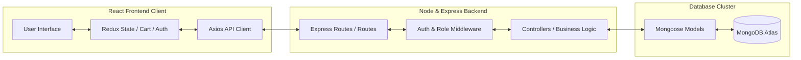
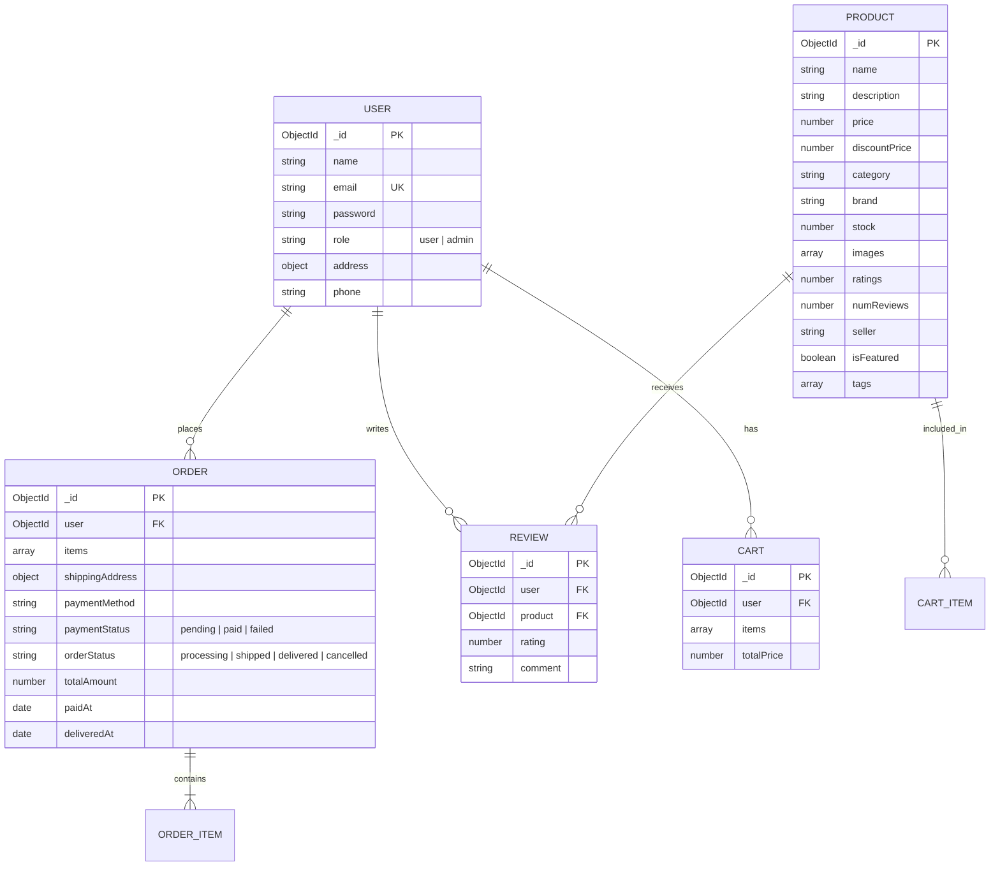

# 🛒 ShopEZ — Full Stack MERN E-Commerce Platform

> A feature-rich, responsive e-commerce web application built with the MERN stack — MongoDB, Express.js, React.js (Vite), and Node.js.

---

## 📂 MERN Phase Wise Templates

This project includes a structured set of phase-wise templates and design documentation located in the [MERN Phase Wise](./MERN%20Phase%20Wise/) folder.

### 📁 Phase-wise Templates
- **Brainstorming & Ideation Phase**:
  - [Brainstorming, Idea Generation & Prioritization Template](./MERN%20Phase%20Wise/Phase%20Wise%20Templates/Brainstorming%20%26%20Ideation%20Phase/Brainstorming%20-%20Idea%20Generation%20-%20Prioritization%20Template.pdf)
  - [Define Problem Statements Template](./MERN%20Phase%20Wise/Phase%20Wise%20Templates/Brainstorming%20%26%20Ideation%20Phase/Define%20Problem%20Statements%20Template.pdf)
  - [Empathy Map Canvas](./MERN%20Phase%20Wise/Phase%20Wise%20Templates/Brainstorming%20%26%20Ideation%20Phase/Empathy%20Map%20Canvas.pdf)
- **Project Design Phase**:
  - [Problem - Solution Fit Template](./MERN%20Phase%20Wise/Phase%20Wise%20Templates/Project%20Design%20Phase/Problem%20-%20Solution%20Fit%20Template.pdf)
  - [Proposed Solution Template](./MERN%20Phase%20Wise/Phase%20Wise%20Templates/Project%20Design%20Phase/Proposed%20Solution%20Template.pdf)
  - [Solution Architecture Template](./MERN%20Phase%20Wise/Phase%20Wise%20Templates/Project%20Design%20Phase/Solution%20Architecture%20Template.pdf)
- **Project Development**:
  - [User Acceptance Testing (UAT) FSD](./MERN%20Phase%20Wise/Phase%20Wise%20Templates/Project%20Development/User%20Acceptance%20Testing%20FSD.pdf)
- **Project Planning Phase**:
  - [Project Planning Template](./MERN%20Phase%20Wise/Phase%20Wise%20Templates/Project%20Planning%20Phase/Project%20Planning%20Template.pdf)
- **Requirement Analysis**:
  - [Data Flow Diagrams and User Stories](./MERN%20Phase%20Wise/Phase%20Wise%20Templates/Requirement%20Analysis/Data%20Flow%20Diagrams%20and%20User%20Stories.pdf)
  - [Solution Requirements](./MERN%20Phase%20Wise/Phase%20Wise%20Templates/Requirement%20Analysis/Solution%20Requirements.pdf)
  - [Technology Stack Template](./MERN%20Phase%20Wise/Phase%20Wise%20Templates/Requirement%20Analysis/Technology%20Stack%20Template.pdf)

### 📁 Project Documentation Reference
- [FSD Documentation Format](./MERN%20Phase%20Wise/Project%20Documentation/FSD%20Documentation%20Format.pdf)

---

## 📝 MERN Stack Phase-Wise Project Documentation

This section provides the compiled walkthrough of the requirements, architecture, designs, sprint plans, and functional specifications of the ShopEEZ E-Commerce platform.

### 💡 Phase 1: Brainstorming & Ideation

#### 1.1 Conception & Brainstorming Focus
ShopEEZ is conceived as a premium, lightweight full-stack e-commerce experience. Key ideation focus areas include:
*   **Visual Aesthetics**: A responsive, dark-themed storefront using vanilla CSS variables for fluid layout control.
*   **Persistent Shopping Session**: Integrating Redux state slices with LocalStorage and MongoDB synchronization to prevent cart contents loss.
*   **Authentication & Security**: Securing customer details using JWT sessions combined with salted Bcrypt password hashing.

#### 1.2 MoSCoW Prioritization Matrix
*   **Must Have**: User Registration & Login (JWT), Product Catalog, Product Detail views, Shopping Cart (persist in LocalStorage), Address/Checkout processing, and Admin Product CRUD.
*   **Should Have**: Persistent Wishlist, Admin Dashboard Analytics, and Catalog Search/Category filters.
*   **Could Have**: Customer Review submissions and Cloudinary integration for catalog media storage.
*   **Won't Have**: Live credit card payment processing (mock payments are used instead) and carrier SMS updates.

#### 1.3 Empathy Map Canvas
*   **Customer Persona (Rahul)**:
    *   *Think/Feel*: Worried about checkout security, excited about fast page rendering and premium dark aesthetics.
    *   *See*: Clean product catalogs with prices, brand tags, and rating reviews.
    *   *Do/Say*: Filters products by category/price, adds favorites to wishlist, inputs shipping coordinates.
    *   *Pains/Gains*: Frustrated by session reloads wiping out carts. Pleased with persistent, synchronized baskets.
*   **Admin Persona (Sarah)**:
    *   *Think/Feel*: Wants simple catalog updates, feels anxious when orders stack up unfulfilled.
    *   *See*: Dashboard statistics showing sales metrics, user growth, and low-stock indicators.
    *   *Do/Say*: Seed products, edit prices, update fulfillment states (`processing` → `shipped` → `delivered`).
    *   *Pains/Gains*: Needs instant CRUD options without manual DB script edits.

---

### 📋 Phase 2: Requirement Analysis

#### 2.1 Solution Requirements
*   **Functional**:
    1.  *Authentication*: Register, login, encrypt passwords, enforce admin-only middleware routes.
    2.  *Catalog*: Real-time search, filters (price range, ratings, categories), sorting (price asc/desc, new arrivals).
    3.  *Transactions*: Add/edit cart items, validate stock levels upon placing orders, create persistent order invoice documents.
    4.  *Administration*: Display statistics summary cards, allow product creation/editing/deletion, toggle order statuses.
*   **Non-Functional**:
    1.  *Performance*: Dynamic React Router paths loading views in under 150ms. API query executions completing in under 300ms.
    2.  *Security*: Authenticated routing using JWT verification tokens.

#### 2.2 Technology Stack Blueprint
*   **Frontend**: React 19, Redux Toolkit, React Router v6, Axios, Vanilla CSS.
*   **Backend**: Node.js, Express.js (ES Modules syntax).
*   **Database**: MongoDB Atlas using Mongoose ODM.
*   **Security**: JSON Web Tokens (JWT) + Bcrypt.js password encryption.

---

### 🎨 Phase 3: Project Design

#### 3.1 Proposed System Flows & MVC Decoupling


#### 3.2 Database Entity Relationship Diagram (ERD)


---

### 📅 Phase 4: Project Planning

#### Weekly Milestones Matrix
*   **Week 1 (Conception)**: Requirement analysis, empathy maps, architecture diagrams, and DB schema modeling.
*   **Week 2 (Backend Core)**: Scaffolding Express, configuring Mongoose models, writing routing controllers, and creating DB seeds.
*   **Week 3 (Frontend Core)**: Setting up Vite React client, configuring Redux state slices, writing vanilla CSS layouts, and implementing client-side routing.
*   **Week 4 (Integration & UAT)**: Connecting Axios requests with JWT interceptors, implementing the Admin Dashboard CRUD, executing UAT verification scripts, and hosting resources.

---

### 🧪 Phase 5: Project Development & UAT

#### User Acceptance Testing Checklist

| Module | Test Action | Expected Result | Status |
| :--- | :--- | :--- | :--- |
| **Auth** | Sign Up with new credentials | Encrypts password, creates record in DB, routes to Home | Pass |
| **Auth** | Log in with invalid password | Returns HTTP 401 error, displays toast warning | Pass |
| **Catalog** | Input query in search bar | Product list filters instantly matching name/description | Pass |
| **Cart** | Adjust item quantity | Automatically updates subtotal and recalculates taxes | Pass |
| **Checkout** | Place mock order | Decrements product stock levels, clears cart, saves invoice | Pass |
| **Admin** | Create new product via form | Product is added to database and rendered in catalog | Pass |
| **Admin** | Toggle order shipping status | Database state shifts from `processing` to `shipped` | Pass |

---

### 📄 FSD Documentation: Reference Manual

This section serves as the technical reference manual mapping the controllers, database schemas, and endpoints of the application.

#### 1. Database Collections
1.  **Users ([User.js](./server/models/User.js))**: Encrypts password on `pre-save` hook using bcrypt. Methods include `matchPassword`.
2.  **Products ([Product.js](./server/models/Product.js))**: Stores inventory properties, featuring brand, stock, images array, rating metrics, and featured flags.
3.  **Carts ([Cart.js](./server/models/Cart.js))**: Maps dynamic shopping baskets to specific user IDs, storing items arrays and total price values.
4.  **Orders ([Order.js](./server/models/Order.js))**: Tracks user purchases, shipping coordinates, payment status (`pending`, `paid`, `failed`), and shipping status (`processing`, `shipped`, `delivered`, `cancelled`).
5.  **Reviews ([Review.js](./server/models/Review.js))**: Stores product reviews and star ratings.

#### 2. REST API Specification

##### 🔐 Authentication Routes (`/api/auth`)
*   `POST /api/auth/register` — Standard registration validation.
*   `POST /api/auth/login` — Verifies password, returns user payload + JWT authorization header.
*   `GET /api/auth/profile` — Returns profile settings of the currently logged-in user.

##### 📦 Product Catalog Routes (`/api/products`)
*   `GET /api/products` — Retrieve all listings (supports search query, categories filters, and price sorting).
*   `GET /api/products/:id` — Details of a specific product.

##### 🛒 Shopping Cart Routes (`/api/cart`)
*   `GET /api/cart` — Fetches user-specific cart configurations.
*   `POST /api/cart` — Adds items or changes item quantities.
*   `DELETE /api/cart/:productId` — Removes a product from the shopping cart.

##### 💳 Transaction Order Routes (`/api/orders`)
*   `POST /api/orders` — Submits a checkout order.
*   `GET /api/orders/my-orders` — Returns transaction histories for the customer.

##### 🛠️ Administrator Routes (`/api/admin`)
*   `GET /api/admin/stats` — Renders dashboard insights cards (User counts, product counts, revenue sum, low stock notices).
*   `POST /api/admin/products` — Inserts a new catalog item.
*   `PUT /api/admin/products/:id` — Edits product metadata.
*   `DELETE /api/admin/products/:id` — Removes product records from MongoDB.
*   `PUT /api/admin/orders/:id` — Toggles order status.

---

## 🌟 Features

### 👤 Customer
- Browse products by category, search, filter (price range, rating), and sort
- Detailed product pages with image gallery, specs, and reviews
- Add to Cart and Wishlist (localStorage-persisted)
- Secure Checkout with shipping address and payment method selection
- Order tracking, history, and cancellation
- User profile with saved address and password management

### 🛠️ Admin
- Dashboard with total sales, orders, users, and revenue stats
- Low stock alerts and recent orders overview
- Full product management (CRUD + image URLs)
- Order status management (processing → shipped → delivered)
- User management (view and delete)

---

## 🧰 Tech Stack

| Layer      | Technology                                |
|------------|-------------------------------------------|
| Frontend   | React 19, Redux Toolkit, React Router v6  |
| Backend    | Node.js, Express.js (ES Modules)          |
| Database   | MongoDB with Mongoose                     |
| Auth       | JWT + bcryptjs                            |
| Image Upload | Cloudinary (or local fallback)          |
| Styling    | Vanilla CSS (premium dark theme)          |

---

## 🚀 Getting Started

### Prerequisites
- Node.js v18+
- MongoDB (running locally or a remote Atlas connection string)

### 1. Clone the Repository
```bash
git clone https://github.com/saisathwikgoudbodige-spec/VIP-C2-ShopEEZ-E-Commerce-Application.git
cd VIP-C2-ShopEEZ-E-Commerce-Application
```

### 2. Install Dependencies
Install dependencies for both frontend and backend automatically from the root folder:
```bash
npm run install:all
```

### 3. Setup Environment Variables
Ensure you have `.env` files in both the `server` and `client` directories with correct ports and keys:
- **Server `.env`**: Make sure your `MONGO_URI` is correct (defaults to local MongoDB `mongodb://localhost:27017/shopez`).
- **Client `.env`**: Make sure `VITE_API_URL` points to `http://localhost:5000/api`.

### 4. Seed the Database (Add Products & Users)
To populate MongoDB with products and testing accounts:
```bash
npm run seed
```

### 5. Running the Application
Open two separate Command Prompt or terminal windows to run the servers concurrently:

- **Window 1 (Backend Server)**:
  ```bash
  npm run dev:server
  ```
- **Window 2 (Frontend Client)**:
  ```bash
  npm run dev:client
  ```

### 6. Open in Browser
- **Frontend URL**: http://localhost:5173
- **Backend API URL**: http://localhost:5000

---

## 🔑 Test Accounts (after seeding)

| Role  | Email               | Password   |
|-------|---------------------|------------|
| Admin | admin@shopez.com    | Admin@123  |
| User  | user@shopez.com     | User@123   |

---

## 📁 Project Structure

```
shopez/
├── client/          # React + Vite frontend
│   └── src/
│       ├── components/     # Navbar, Footer, Cards, etc.
│       ├── pages/          # All customer-facing pages
│       │   └── admin/      # Admin panel pages
│       ├── redux/          # RTK slices + store
│       ├── api/            # Axios instance
│       └── utils/          # Helper utilities
├── server/          # Express backend
│   ├── config/      # Database connection
│   ├── controllers/ # Route business logic
│   ├── middleware/  # Auth, admin, error, upload
│   ├── models/      # Mongoose schemas
│   ├── routes/      # Express route definitions
│   └── seed.js      # Database seeder
└── README.md
```

---

## 🤝 Contributing

Pull requests are welcome. For major changes, please open an issue first to discuss what you'd like to change.

## 📄 License

[MIT](LICENSE)
